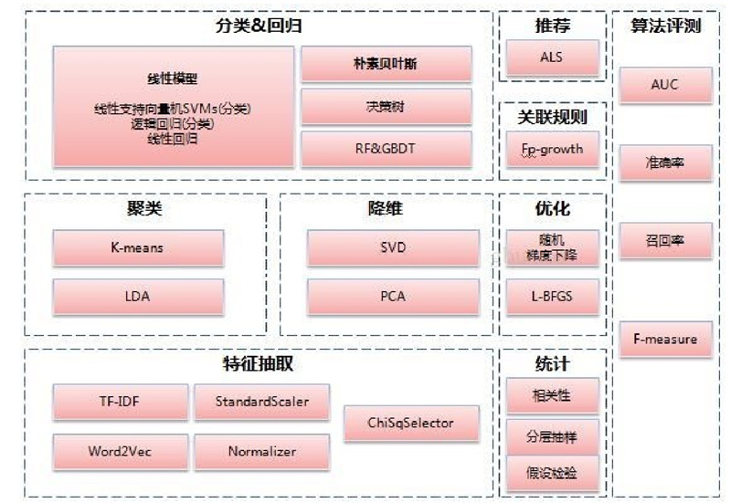

## 第1章 Spark大数据分析概述

本章主要知识点：·什么是大数据？·数据要怎么分析？·Spark 3.0核心———ML能帮我们做些什么？

### 1.1　大数据时代

大数据科学家JohnRauser提到一个简单的定义：“大数据就是任何超过了一台计算机处理能力的庞大数据量”。

### 1.2　大数据分析的要素

1．有效的数据质量任何数据分析都来自于真实的数据基础，而一个真实数据是采用标准化的流程和工具对数据进行处理得到的，可以保证一个预先定义好的高质量的分析结果。

2．优秀的分析引擎对于大数据来说，数据的来源多种多样，特别是非结构化数据，其来源的多样性给大数据分析带来了新的挑战。因此，我们需要一系列的工具去解析、提取、分析数据。大数据分析引擎用于从数据中提取我们所需要的信息。

3．合适的分析算法采用合适的大数据分析算法，能让我们深入数据内部挖掘价值。在算法的具体选择上，不仅要考虑能够处理的大数据数量，还要考虑对大数据处理的速度。

4．对未来的合理预测数据分析的目的是对已有数据体现出来的规律进行总结，并且将现象与其他情况紧密连接在一起，从而获得对未来发展趋势的预测。大数据分析也是如此。不同的是，在大数据分析中，数据来源的基础更为广泛，需要处理的方面更多。

5．数据结果的可视化大数据的分析结果更多的是为决策者和普通用户提供决策支持和意见提示，其对较为深奥的数学含义不会太了解。因此，必然要求数据的可视化能够直观地反映出经过分析后得到的信息与内容，能够较为容易地被使用者所理解和接受。

### 1.3　简单、优雅、有效———这就是Spark

Apache Spark是加州大学伯克利分校的AMPLabs开发的开源分布式轻量级通用计算框架。与传统的数据分析框架相比，Spark在设计之初就是基于内存而设计的，因此比一般的数据分析框架具有更高的处理性能，并且对多种编程语言（例如Java、Scala及Python等）提供编译支持，使得用户使用传统的编程语言即可进行程序设计，从而使得用户的快速学习和代码维护能力大大提高。

简单、优雅、有效——这就是Spark！

### 1.4　Spark 3.0核心——ML

ML主要操作的是DataFrame，而MLlib操作的是RDD，也就是说二者面向的数据集不一样。相比于MLlib在RDD提供的基本操作，ML在DataFrame上的抽象级别更高，数据和操作耦合度更低。ML中的操作可以使用Pipeline，跟Sklearn一样，可以把很多操作（算法、特征提取、特征转换）以管道的形式串起来，然后让数据在这个管道中流动。ML中无论是什么模型，都提供了统一的算法操作接口，比如模型训练都是fit。

图1-2　ML的算法和工具类

### 1.5　星星之火，可以燎原

Spark一个新兴的、能够便捷和快速处理海量数据的计算框架，得到了越来越多从业者的关注与重视。